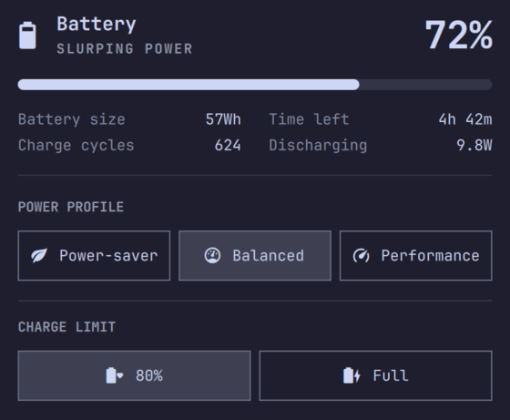

# Asus Battery Cap

Charge limit picker for the Omarchy power panel.



## What it does

Adds a CHARGE LIMIT section to the Omarchy power panel with 80 percent and Full (100 percent) buttons. It matches the built in power profile picker style. Uses asusctl, so picks need no password and asusd persists them.

## Requirements

ASUS laptop with asusctl installed and asusd running:

```bash
omarchy pkg add asusctl
sudo systemctl start asusd.service
```

Tested on ASUS Zenbook UX3404VA.

## Install

```bash
omarchy plugin add https://github.com/niraletter/asus-battery-cap.git --enable
```

## Use

Open the power panel from the bar and pick 80 percent or Full. Quicker from terminal:

```bash
asusctl battery limit 80
asusctl battery limit 100
asusctl battery info
```

## Manage

```bash
omarchy plugin list
omarchy plugin update asus.batterycap
omarchy plugin remove asus.batterycap
```
